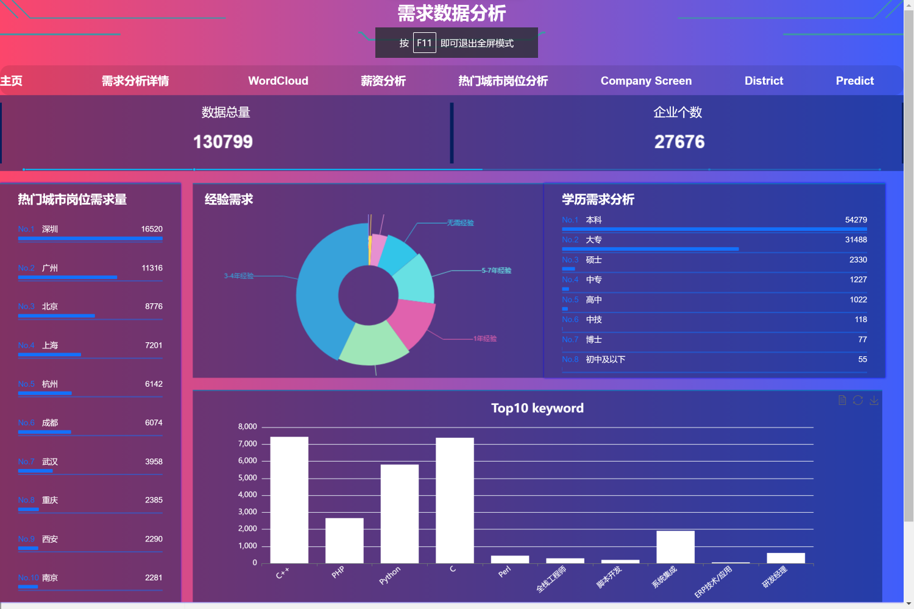
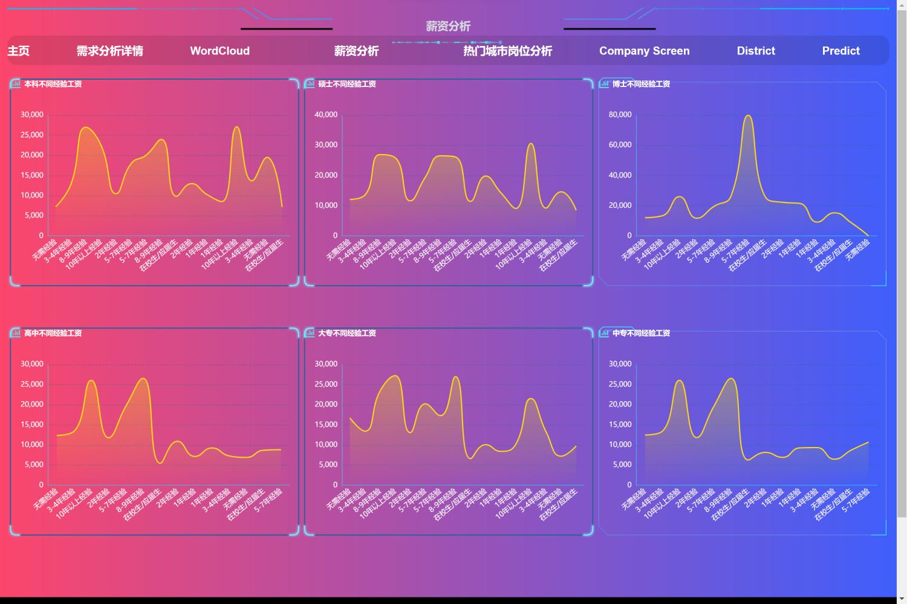
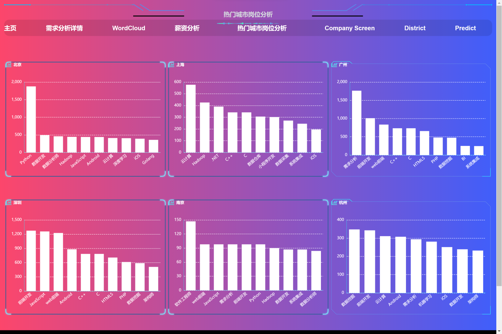
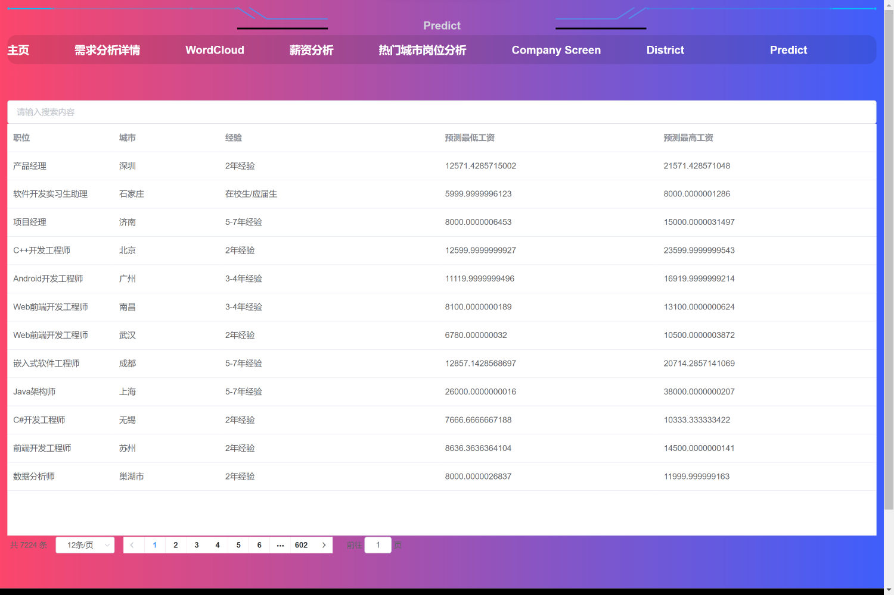

## 基于Spark的互联网行业分析系统

- 项目描述：本项目基于Spark,对互联网招聘信息进行分析，包括薪资、岗位、学历等，并基于机器学习对工资进行预测。
-  技术和工具：Python,PySpark,Vue,MySQL,机器学习
-  功能和成果：功能和成果：实现了一个基于Spark的大数据分析系统，能够处理大规模的互联网行业数据，并进行薪资、学历和岗位等因素的分
   析；利用机器学习算法对数据进行挖掘和预测。
---
成果展示
---
- 需求数据分析

- 薪资分析

- 热门城市岗位分析

- 薪资预测

