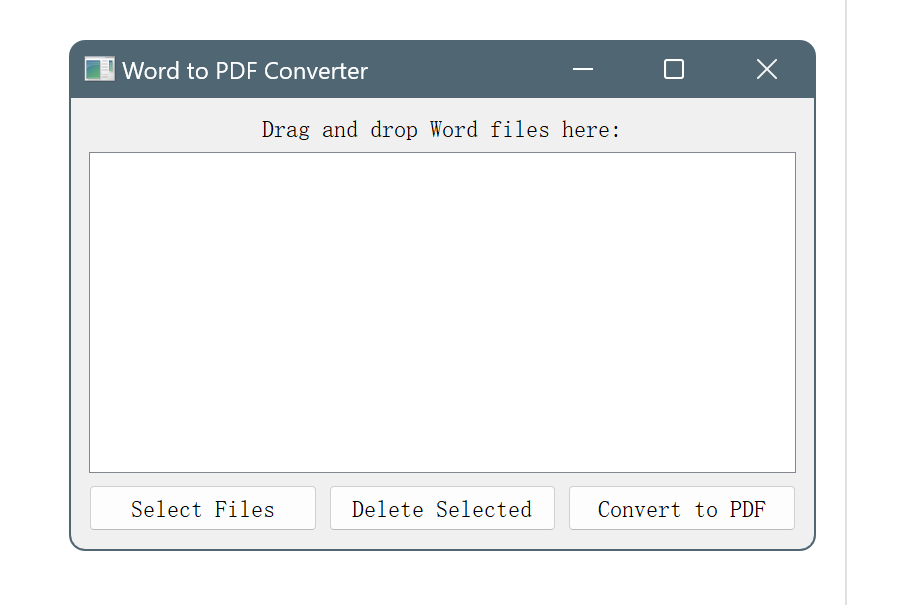

# Word转PDF📑：简单高效的文件格式转换工具

Word转PDF是一种流行的文件格式转换工具，它允许用户将Microsoft Word文档(.docx或.doc)转换为Adobe PDF格式(.pdf)。这种转换过程提供了许多优点，使得Word转PDF成为日常办公和文件共享中的首选工具。

## 优点

1. **跨平台兼容性**：PDF格式是一种广泛支持的文件格式，在各种操作系统（如Windows、Mac和Linux）以及各种设备上（包括计算机、平板电脑和智能手机）都能够轻松打开和查看。通过将Word文档转换为PDF，您可以确保接收者无论使用何种设备或操作系统，都能够准确地查看和阅读您的文档。

2. **保护文档内容**：与Word文档相比，PDF格式提供了更高的安全性。通过将Word文档转换为PDF，您可以添加安全选项，如密码保护，以限制对文档的访问权限。此外，PDF还可以防止他人对文档内容进行修改、复制或粘贴，从而有效保护您的知识产权。

3. **保持格式一致**：Word文档在不同的计算机上可能会因为字体、布局和格式的差异而显示不一致。转换为PDF后，文档的外观将保持不变，无论在哪种设备上查看，都能呈现出一致的格式和布局。这对于专业文档、报告和简历等重要文件来说尤为重要，以确保内容的完整性和专业形象。

4. **压缩文件大小**：PDF格式通常比Word文档更紧凑，可以显著减小文件的大小。这对于通过电子邮件或在线共享文档时非常有用，可以加快传输速度并节省存储空间。

5. **易于打印**：PDF格式可确保文档在打印时保持原始格式和布局，无论是简单的文本文件还是包含复杂图表和图片的文件。这对于需要纸质文档的场景非常有用，如打印报告、合同或宣传资料。
---
毕业季需要大量的Word转PDF，但是Word转PDF的软件很多都是收费的，而且有的软件还会在转换的PDF文件上加上水印，这样就很不方便了。所以我就想用ChatGPT写代码来解决这一问题，这样就可以免费转换了。

‘’‘ python

        import sys
        # coding:utf-8
        from PyQt5.QtWidgets import QApplication, QMainWindow, QLabel, QListWidget, QPushButton, QVBoxLayout, QWidget, \
        QFileDialog, QMessageBox, QHBoxLayout
        from PyQt5.QtCore import Qt
        from docx2pdf import convert

        class MainWindow(QMainWindow):
        def __init__(self):
        super().__init__()
        self.setWindowTitle("Word to PDF Converter")
        self.resize(400, 300)

        # 创建主窗口部件和布局
        main_widget = QWidget(self)
        layout = QVBoxLayout(main_widget)
        main_widget.setLayout(layout)
        self.setCentralWidget(main_widget)

        # 创建标签和文件列表框
        label = QLabel("Drag and drop Word files here:", self)
        label.setAlignment(Qt.AlignCenter)
        layout.addWidget(label)

        self.file_list = QListWidget(self)
        layout.addWidget(self.file_list)

        # 创建按钮
        button_layout = QHBoxLayout()
        layout.addLayout(button_layout)

        select_button = QPushButton("Select Files", self)
        select_button.clicked.connect(self.select_files)
        button_layout.addWidget(select_button)

        delete_button = QPushButton("Delete Selected", self)
        delete_button.clicked.connect(self.delete_file)
        button_layout.addWidget(delete_button)

        convert_button = QPushButton("Convert to PDF", self)
        convert_button.clicked.connect(self.convert_files)
        button_layout.addWidget(convert_button)

        # 设置拖拽事件
        self.setAcceptDrops(True)

        self.file_list.setDragDropMode(QListWidget.DragDrop)
        self.file_list.setDefaultDropAction(Qt.CopyAction)
        self.file_list.setSelectionMode(QListWidget.ExtendedSelection)

        self.file_paths = []

    def select_files(self):
        file_dialog = QFileDialog(self)
        file_dialog.setFileMode(QFileDialog.ExistingFiles)
        file_dialog.setNameFilter("Word files (*.docx)")
        if file_dialog.exec_():
            files = file_dialog.selectedFiles()
            self.file_list.addItems(files)
            self.file_paths += files

    def delete_file(self):
        selected_items = self.file_list.selectedItems()
        for item in selected_items:
            index = self.file_list.indexFromItem(item).row()
            self.file_list.takeItem(index)
            del self.file_paths[index]

    def convert_files(self):
        if not self.file_paths:
            QMessageBox.warning(self, "No Files", "Please select at least one file.")
            return

        try:
            for file_path in self.file_paths:
                output_path = file_path.replace(".docx", ".pdf")
                convert(file_path, output_path)
            QMessageBox.information(self, "Conversion Complete", "Files successfully converted to PDF.")
            self.file_list.clear()
            self.file_paths = []
        except Exception as e:
            QMessageBox.critical(self, "Conversion Error", str(e))

    def dragEnterEvent(self, event):
        if event.mimeData().hasUrls():
            event.acceptProposedAction()

    def dropEvent(self, event):
        for url in event.mimeData().urls():
            file_path = url.toLocalFile()
            if file_path.endswith(".docx"):
                self.file_list.addItem(file_path)
                self.file_paths.append(file_path)

    if __name__ == "__main__":
    app = QApplication(sys.argv)
    window = MainWindow()
    window.show()
    sys.exit(app.exec_())

’‘’
- 运行界面

- 将转化的文件拖拽进窗口，点击转化按钮，即可转化为pdf文件，可批量处理文件。

<Vssue title="评论" />